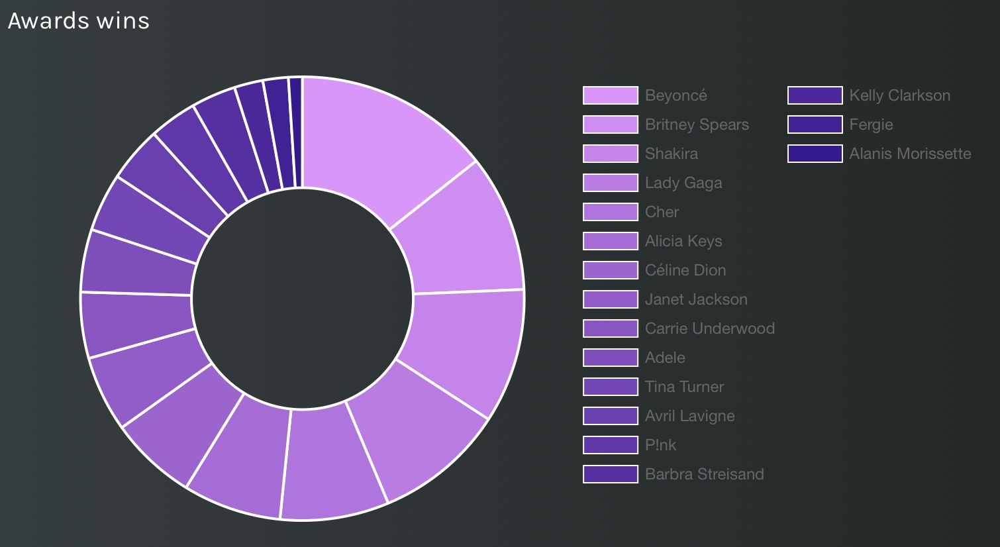
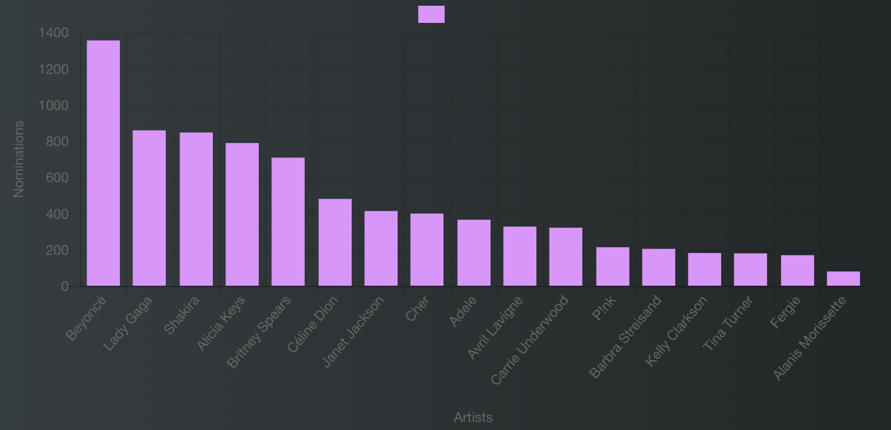

<html>

<head>
<title>Project</title>
<meta charset="utf-8">
<meta name="viewport" content="width=device-width, initial-scale=1">

</head>
<body>

 <h1>Discover the Magic of Music</h1>

  <a href="https://veronicacopparoni.github.io/Homepage">Home</a>
  <a href="https://veronicacopparoni.github.io/Best-female-music-artists">Best female music artists</a>
  <a href="https://veronicacopparoni.github.io/Reports/">Reports</a>

</body>
</html>

<body>

<h1>Best female music artists</h1>  
<h2>A story written by Veronica Copparoni and Tatiana Giacobbo</h2>

For a long time female music artists have been underrepresented in the music scene, lacking the recognition and visibility they deserve just because they are women. Even though they possessed (or possess) skills at an equivalent level – or, often, better – than their male counterparts, they have often faced disparities and barriers, making it difficult for them to showcase the significant contribution they made in the music sector. Though, we can boast of a rich list of female music artists who throughout the decades have made a powerful impact with their unique voices, strong advocacy and creative endeavors. Not only did they break any record with memorable hits, but also they have become cultural icons and symbols of female empowerment in the whole world. Therefore, with our research we wanted to explore all these women who, thanks to their talent and impactful artistic productions, have made their way to become successful music artists of all time and who somehow opened the doors for change in the music business. So, have a look at our story on Melody, where you can see a list of the best selling female artists in the musical world, both legendary names who dominated the music scene in the ‘70s and ‘80s and also prominent figures of the 21st century! 

The true impact and success of an artist can be ascertained through the sale of their albums, therefore this was the criteria behind the composition of the list that you can explore in our interesting story on Melody. Here, you can also find information about their birth date and, above all, about the year they started their career, so as to give you an idea of when they began to build their way up to success and fame. But that’s just the beginning! 

We all know that getting a prize, such as a Grammy Award, represents a remarkable and prestigious recognition of one’s works and achievements in the music sector. So, can you guess who is the female artist who won the highest number of awards in the history of music and how many are these? By looking at the doughnut chart you will not only get the answer, but you will see the exact number of awards won by each of these female artists. 

 

    
  

 
 

Another significant recognition that in the music industry female artists usually get for their artistic productions is the nomination for awards and prizes, by means of specific categories, such as a “album of the year” and “best music video” and so on. Therefore, similarly, the bar chart explores the number of nominations that most popular female musicians received during their career in music. This chart is also really useful for you to compare the results from this chart with those that you find in the previous chart. 

 

    
  

  
 
 

Last but not least, if you are curious and you want to know more about the best selling female artists of all time, you can also have a look at the place of where they were born, thanks to the map you find in the story and so you can see what is the country from which the largest number of most successful women in the music industry come.

Either you are into music or just curious about knowing something new, we believe that this story gives you an interesting insight of all women who have stood the test of time and made history with their outstanding voices and unique ways of expressing universal truths. 
What are you waiting for? Click <a href="https://melody-data.github.io/stories/published_stories/story_1686643551.648723.html">here</a> to check our story on Melody!

 

 
  

  
Footer

  

